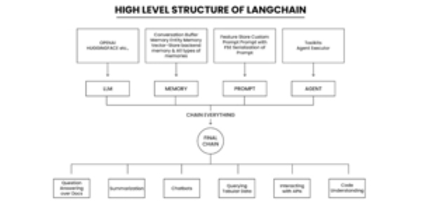

# What is LangChain?

LangChain is an **open-source framework** designed to simplify the development of applications powered by large language models (LLMs). It provides developers with a comprehensive toolkit to build, deploy, and manage AI applications that can interact with external data sources, maintain context, and perform complex reasoning tasks.

At its core, LangChain acts as a **bridge between LLMs and real-world applications**, enabling developers to create sophisticated AI systems without having to build everything from scratch. The framework provides standardized interfaces, pre-built components, and orchestration tools that make it easier to integrate language models into production applications.

## Why LangChain and Similar Frameworks Were Developed

### **The Core Problem**

LLMs like GPT-4, Claude, or PaLM excel at responding to prompts in general contexts, but they **struggle in specific domains** they were never trained on. Additionally, they lack access to **real-time or proprietary information**, which limits their ability to provide accurate, up-to-date responses for business-specific applications.

### **Key Needs That Led to Framework Development**

- **Data Integration Complexity**: Connecting LLMs to external data sources (databases, documents, APIs) required custom solutions each time
- **Prompt Engineering Challenges**: Refining inputs to generative models with specific structure and context was time-consuming and complex
- **Lack of Standardization**: The growing number of models and components resulted in diverse APIs that developers had to learn individually, making it challenging to switch between providers
- **Orchestration Requirements**: As applications became more complex, combining multiple components and models into efficient control flows became crucial
- **Development Time**: Building AI applications from scratch meant "reinventing the wheel" repeatedly


## Advantages of LangChain Framework

### **Technical Benefits**

- **Standardized Component Interfaces**: Provides uniform APIs for different LLM providers, making it easy to switch between models without major code changes
- **Abstraction of Complexity**: Simplifies data source integrations and prompt engineering, allowing developers to focus on business logic rather than technical implementation
- **Modular Architecture**: Enables building scalable and flexible applications that can adapt to changing requirements
- **Ready-Made Building Blocks**: Offers pre-built modules for common LLM tasks like prompt templates, model calls, and vector embeddings


### **Development Advantages**

- **Enhanced Productivity**: Significantly reduces development time by abstracting LLM integration complexities
- **Performance Optimization**: Framework is optimized for responsive and scalable applications
- **Community Support**: Open-source project with active community contribution and support
- **Future-Proof Design**: Modular structure ensures adaptability to evolving AI advancements


### **Business Benefits**

- **Reduced Hallucination**: Implements Retrieval Augmented Generation (RAG) workflows that introduce contextual information, improving response accuracy
- **Domain-Specific Applications**: Enables repurposing LLMs for specific use cases without retraining or fine-tuning
- **Cost Efficiency**: Streamlines development process, reducing overall project costs and time-to-market


## Types of Applications You Can Build with LangChain

### **Conversational AI Applications**

- **Intelligent Chatbots**: Context-aware chatbots with memory that can maintain conversations across multiple interactions
- **Virtual Assistants**: AI agents that can handle complex customer service tasks and provide personalized support
- **Customer Service Systems**: Automated support systems that integrate with company knowledge bases


### **Knowledge Management Solutions**

- **Question-Answering Systems**: Applications that can answer questions based on private documents and databases
- **Document Summarization**: Tools that process vast amounts of information and create concise summaries
- **Research Assistants**: Systems that can analyze and extract insights from large document collections


### **Content Generation Applications**

- **Automated Content Creation**: Applications for generating blog posts, marketing copy, and documentation
- **Code Generation**: Tools that can automatically generate code based on natural language descriptions
- **Creative Writing Assistants**: Applications that help with creative content production


### **Business Intelligence Tools**

- **Data Analysis Platforms**: Applications that transform raw business data into actionable insights through natural language queries
- **Sales and Inventory Analysis**: Tools that analyze business metrics without requiring technical skills
- **Multi-Agent Systems**: Complex applications with multiple AI agents handling different specialized tasks like HR automation


### **Specialized Applications**

- **Mathematical Problem Solvers**: Agents capable of solving complex math and reasoning puzzles using LLMMathChain
- **E-commerce Platforms**: Voice-first AI systems for shopping, selling, and booking services
- **Industrial Automation**: Multi-modal guidance systems for critical industrial tasks
- **Anti-Phishing Services**: Security applications that analyze emails and detect threats using LLM-powered inspection


## Simple Application Example: Customer Support Chatbot

Let's consider building a **customer support chatbot for an e-commerce company** that can answer questions about products, orders, and company policies.

### **Traditional Approach (Without LangChain)**

```
1. Set up direct API connections to OpenAI/Claude
2. Manually handle prompt formatting and context management
3. Build custom integrations for each data source (product database, order system, FAQ documents)
4. Implement conversation memory from scratch
5. Handle error cases and fallbacks manually
6. Create custom routing logic for different query types
```


### **LangChain Approach**

```python
from langchain.llms import OpenAI
from langchain.memory import ConversationBufferMemory
from langchain.chains import ConversationalRetrievalChain
from langchain.vectorstores import Chroma
from langchain.embeddings import OpenAIEmbeddings

# 1. Load company documents (FAQs, policies, product info)
vectorstore = Chroma.from_documents(documents, OpenAIEmbeddings())

# 2. Set up conversation memory
memory = ConversationBufferMemory(memory_key="chat_history", return_messages=True)

# 3. Create the conversational chain
qa_chain = ConversationalRetrievalChain.from_llm(
    llm=OpenAI(),
    retriever=vectorstore.as_retriever(),
    memory=memory
)

# 4. Handle customer queries
def handle_customer_query(question):
    response = qa_chain({"question": question})
    return response["answer"]

# Example usage
customer_question = "What's your return policy for electronics?"
answer = handle_customer_query(customer_question)
```


### **What This Application Does**

1. **Retrieves Relevant Information**: Automatically searches through company documents to find relevant context for each customer question
2. **Maintains Conversation Context**: Remembers previous interactions to provide coherent, contextual responses
3. **Provides Accurate Answers**: Uses company-specific information rather than general knowledge, reducing hallucination
4. **Handles Follow-ups**: Can answer related questions based on conversation history
5. **Scales Automatically**: Can handle multiple customers simultaneously without manual intervention

### **Key Benefits Over Manual Implementation**

- **Reduced Development Time**: What would take weeks to build manually is accomplished in hours
- **Built-in Best Practices**: Automatic handling of embeddings, vector search, and memory management
- **Easy Maintenance**: Simple to update knowledge base or switch between different LLM providers
- **Production-Ready**: Includes error handling, logging, and optimization features out of the box

This example demonstrates how LangChain transforms complex AI application development into a straightforward process using pre-built, tested components that work together seamlessly.

